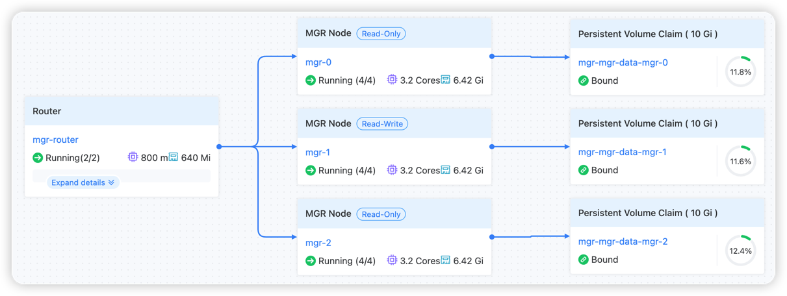

# Architecture

## MGR Architecture

Under the Server layer and Replica layer of MySQL, group replication is divided into three layers:

- Group Replication Logic Layer: Responsible for interacting with the Server layer, sending, receiving, and replaying transactions to the Group Communication System Layer.
- Group Communication System Layer: Responsible for message passing, fault detection, and cluster member management.
- Paxos Layer: Implemented based on the Paxos protocol, ensuring data order consistency and majority availability.

## MGR Instance Deployment Architecture

### Core Components

- Deploys MySQL members managing MGR as StatefulSets, achieving multi-master replication and high availability through Group Replication.
- Deploys MySQL Router as Deployments that connect to MySQL members in the StatefulSet and provide external read-write separation service capabilities.
- Manages MySQL data storage via PVC to ensure data persistence.
- Provides read-write separation services through two different Services: read-write and read-only.

### Data Flow

1. Client requests are accessed through the MySQL Router's Service.
2. The Router routes requests to the appropriate MySQL node based on the request type.
3. Write operations are synchronized to all nodes through Group Replication.
4. Read operations can be routed to any available node.
