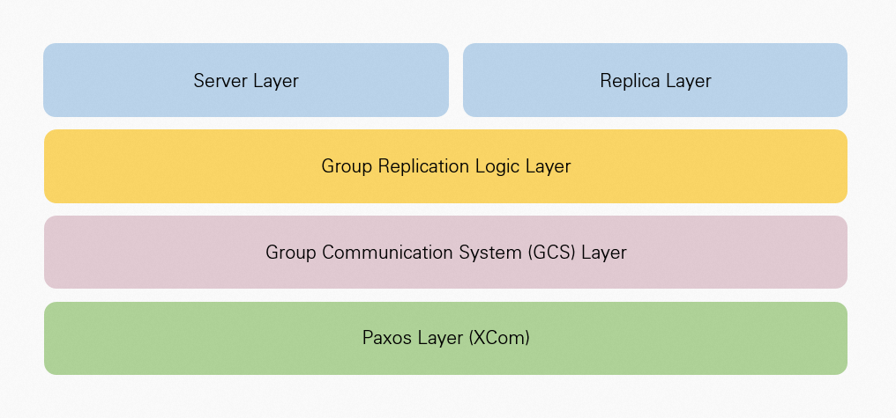
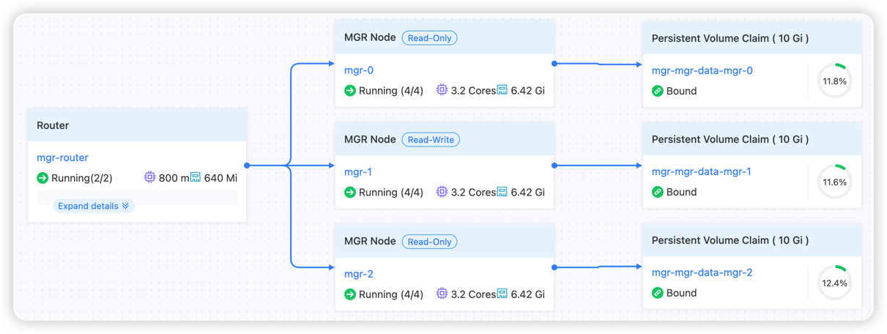

# Архитектура

## Архитектура MGR

В рамках уровня сервера и уровня реплик MySQL групповая репликация разделена на три уровня:

- Логический уровень групповой репликации: отвечает за взаимодействие с уровнем сервера, отправку, получение и воспроизведение транзакций в уровень системы групповой связи.
- Уровень системы групповой связи: отвечает за передачу сообщений, обнаружение ошибок и управление членами кластера.
- Уровень Paxos: реализован на основе протокола Paxos, обеспечивая последовательность порядка данных и доступность большинства.

## Архитектура развертывания экземпляра MGR

### Основные компоненты

- Разворачивает члены MySQL, управляющие MGR, как StatefulSets, достигая многомастерового репликации и высокой доступности через групповую репликацию.
- Разворачивает MySQL Router как Deployments, которые подключаются к членам MySQL в StatefulSet и предоставляют внешние возможности отделения чтения и записи.
- Управляет хранением данных MySQL через PVC для обеспечения постоянства данных.
- Предоставляет услуги отделения чтения и записи через два различных сервиса: для чтения и записи и только для чтения.

### Поток данных

1. Запросы клиентов обрабатываются через сервис MySQL Router.
2. Router направляет запросы к соответствующему узлу MySQL в зависимости от типа запроса.
3. Операции записи синхронизируются на все узлы через групповую репликацию.
4. Операции чтения могут быть направлены на любой доступный узел.
