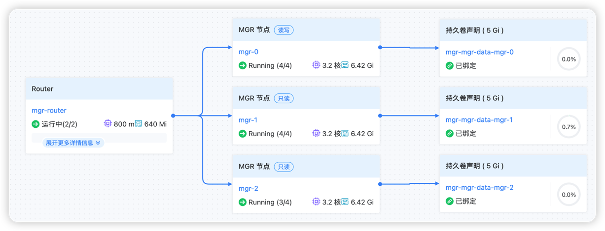

# 架构

## 核心组件

- **MySQL Group Replication**：提供多主复制和数据一致性
- **MySQL Router**：负责读写分离和负载均衡
- **Operator**：自动化管理MySQL集群

## 数据流程

1. 客户端请求通过MySQL Router接入
2. Router根据请求类型路由到合适的MySQL节点
3. 写操作通过Group Replication同步到所有节点
4. 读操作可以路由到任意可用节点

## 部署架构

- 以 StatefulSet 方式部署管理 MGR 的 MySQL 成员
- 以 Deployment 方式部署管理 MySQL Router, 对内连接 StatefulSet 中的 MySQL 成员, 对外提供读写分离服务能力
- 以 read-write 和 read-only 两个不同 Service 提供读写分离服务
