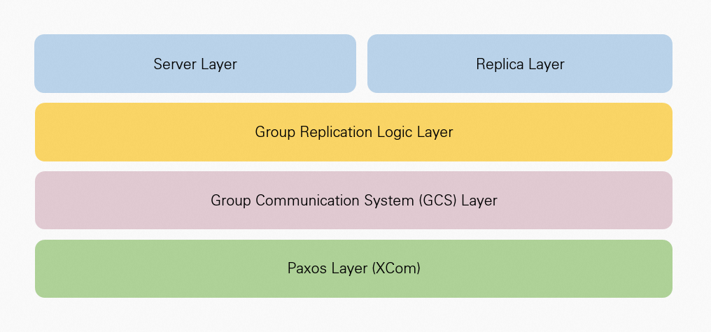
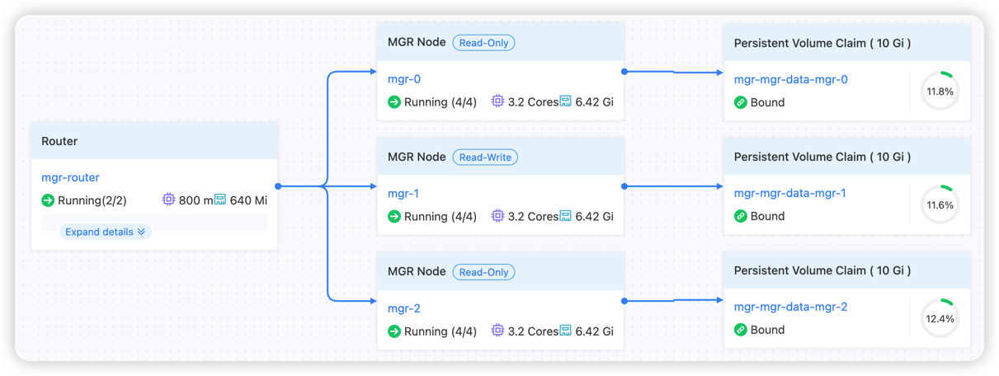

# 架构
## MGR 架构

在MySQL的Server层和Replica层之下，组复制分为三层：
- 组复制层（Group Replication Logic Layer）：负责与Server层交互，向组通讯层发送、接收并回放事务。
- 组通讯层（Group Communication System Layer）：负责消息传递、故障检测和集群成员管理。
- XCom层（Paxos Layer）：基于Paxos协议实现，确保数据顺序一致性和多数派可用性。

## MGR 实例部署架构

### 核心组件

- 以 StatefulSet 方式部署管理 MGR 的 MySQL 成员，通过 Group Replication 实现多主复制和高可用
- 以 Deployment 方式部署管理 MySQL Router，对内连接 StatefulSet 中的 MySQL 成员，对外提供读写分离服务能力
- 以 PVC 方式管理 MySQL 数据存储，保证数据持久化
- 以 read-write 和 read-only 两个不同 Service 提供读写分离服务

### 数据流程

1. 客户端请求通过 MySQL Router 的 Service 接入
2. Router根据请求类型路由到合适的 MySQL 节点
3. 写操作通过 Group Replication 同步到所有节点
4. 读操作可以路由到任意可用节点

